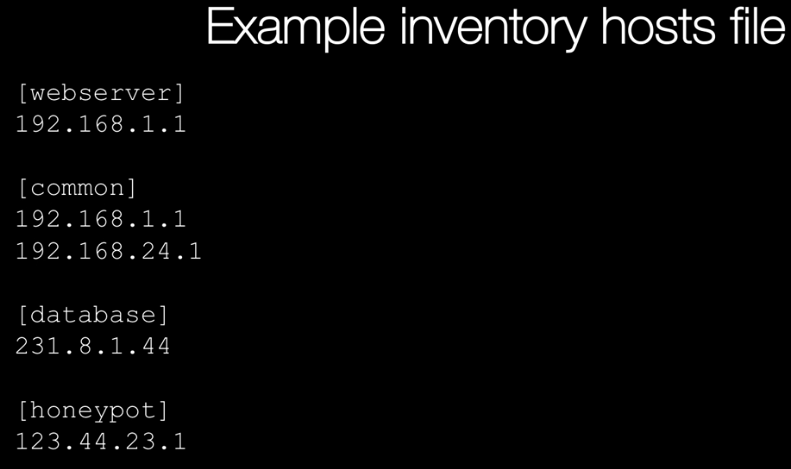
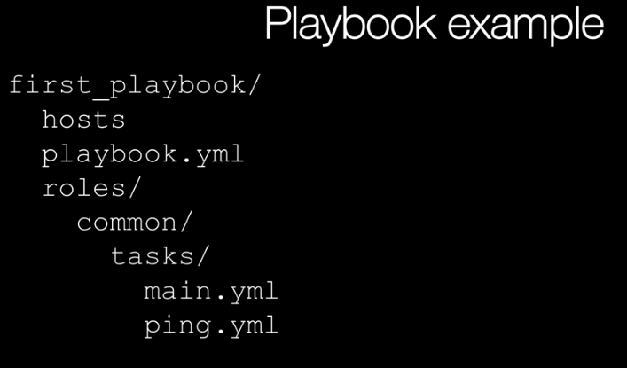
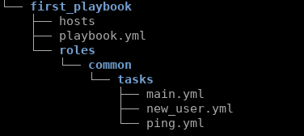
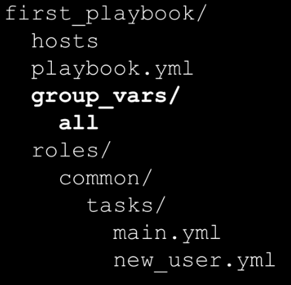
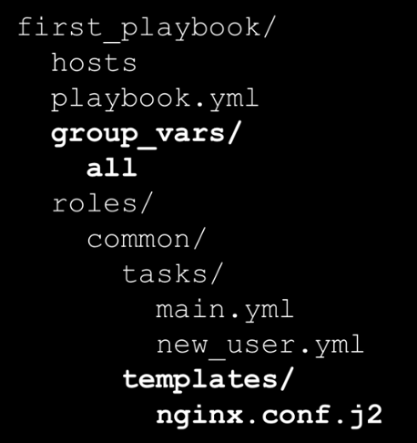
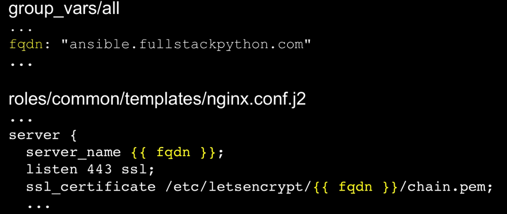
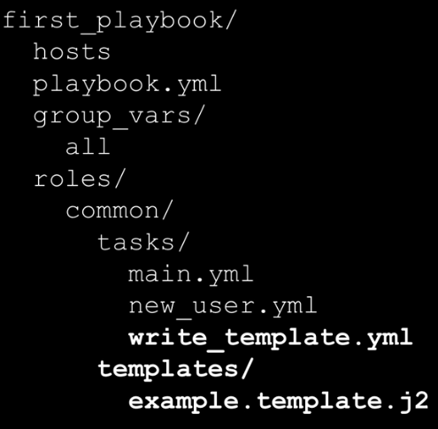

Ansible est un outil d'automatisation. Il permet d'automatiser des choses que les developpeurs ou les admins font manuellement (en général). 

Ansible peut automatiser des étapes de manière à ce que ces étapes soient facilement lisibles et maintenables par les autres.

Par exemple: des configurations de firewall, déploiement d'applications...

Par la suite, nous allons voir les étapes suivantes:
- Pourquoi choisir Ansible? 
- Qu'est-ce que c'est que les `Ansible playbook`?
- Comment configurer des serveurs et sécuriser des données?
- Comment implémenter des SCM (source control management) comme git? (par exemple: afin d'avoir votre propre serveur comme github)?
- Comment deboguer des problèmes sur Ansible?
- Les modules Ansible.
- En tant que projet de fin, nous allons faire le déploiement d'une application web en Ansible

# 1. Pourquoi Ansible?
La première raison est parce que c'est le plus facile de tous les outils d'automatisation.
Il existe d'autres comme `Puppet`, `Chef`...

La deuxième raison est que c'est très maintenable: On peut lire les playbooks quelques années après et les comprendre tout de suite.

Le code source d'ansible peut se trouver sur github (https://github.com/ansible/ansible)

Si vous regardez dans ce repository de code, le plus important à voir est `lib/ansible` (en particulier le dossier `module`) car ce sont les librairies qui est plus important puisque ce sont eux qui font le travail.

Egalement, la doc officielle se trouve dans `https://docs.ansible.com/`. La partie la plus importante pour nous est la partie `Getting started`. On y trouve des guides d'installation, des guides d'utilisations, des exemples et plein de guides sur d'autres aspects de ansible (playbook, ...). Et donc en particulier ce qui nous interesserait le plus est la doc sur les modules (https://docs.ansible.com/ansible/latest/modules/modules_by_category.html) pour toutes les choses que nous devons implémenter (ex: pour les automatisations des actions sur les fichiers, vous pourrez voir le module `file`). Ces documents sont fournies avec des exemples.

Un autre document qui nous interesse également est https://www.fullstackpython.com/table-of-contents.html.  On y trouve un peu de tout.

Les chapitres qui devraient nous intéréssés le plus, sont les chapitre 5 (Deploiements d'application web) et chapitre 6 (Devops).

# 2. Installation de l'environnement

Pour utiliser Ansible, il faut installer le paquet `python3-venv` (virtual environement pour python3).
Cela nous permet d'utiliser un environnement virtuel et ne pas casser notre machine hôte. En effet, python a plusieurs versions de plusieurs librairies et virtualenv nous permet d'avoir des versions pour un environnement donné.

- vérifier qu'on a `python3`

```js
patou@pa-linux:~$ python3 --version
Python 3.7.3
```
- Pour chercher le paquet virtualenv, on va taper la commande suivante.
On peut l'installer en utilisant `pip3` ou en utilisant `apt-get install`. 
Nous allons utiliser `apt-get` pour cette installation.
```bash
patou@pa-linux:~/Documents/bizna/pasFini/Ansible/venvs$ aptitude search venv
p   apt-venv                                                           - apt virtual environment                                                     
p   elpa-pyvenv                                                        - Python virtual environment interface                                        
p   python3-venv                                                       - pyvenv-3 binary for python3 (default python3 version)                       
v   python3-venv:any                                                   -                                                                             
i A python3.7-venv                                                     - Interactive high-level object-oriented language (pyvenv binary, version 3.7)
v   python3.7-venv:any                                                 - 
```
- Nous allons installer alors le paquet:

```sh
patou@pa-linux:~/Documents/bizna/pasFini/Ansible/venvs$ sudo apt-get install python3-venv
Lecture des listes de paquets... Fait
Construction de l'arbre des dépendances       
Lecture des informations d'état... Fait
Les paquets supplémentaires suivants seront installés : 
  python3.7-venv
Les NOUVEAUX paquets suivants seront installés :
  python3-venv python3.7-venv
0 mis à jour, 2 nouvellement installés, 0 à enlever et 14 non mis à jour.
Il est nécessaire de prendre 7 328 o dans les archives.
Après cette opération, 44,0 ko d'espace disque supplémentaires seront utilisés.
Souhaitez-vous continuer ? [O/n] o
Réception de :1 http://ftp.fr.debian.org/debian buster/main amd64 python3.7-venv amd64 3.7.3-2+deb10u2 [6 148 B]
Réception de :2 http://ftp.fr.debian.org/debian buster/main amd64 python3-venv amd64 3.7.3-1 [1 180 B]
7 328 o réceptionnés en 0s (23,3 ko/s)       
Sélection du paquet python3.7-venv précédemment désélectionné.
(Lecture de la base de données... 310023 fichiers et répertoires déjà installés.)
Préparation du dépaquetage de .../python3.7-venv_3.7.3-2+deb10u2_amd64.deb ...
Dépaquetage de python3.7-venv (3.7.3-2+deb10u2) ...
Sélection du paquet python3-venv précédemment désélectionné.
Préparation du dépaquetage de .../python3-venv_3.7.3-1_amd64.deb ...
Dépaquetage de python3-venv (3.7.3-1) ...
Paramétrage de python3.7-venv (3.7.3-2+deb10u2) ...
Paramétrage de python3-venv (3.7.3-1) ...
Traitement des actions différées (« triggers ») pour man-db (2.8.5-2) ...
Scanning processes...                                                                                                                                
Scanning linux images...                                                                                                                             

Running kernel seems to be up-to-date.

Failed to check for processor microcode upgrades.

No services need to be restarted.

No containers need to be restarted.

No user sessions are running outdated binaries.

```
- testons alors l'installation de virtualenv.

```sh
patou@pa-linux:~$ python3 -m venv
usage: venv [-h] [--system-site-packages] [--symlinks | --copies] [--clear]
            [--upgrade] [--without-pip] [--prompt PROMPT]
            ENV_DIR [ENV_DIR ...]
venv: error: the following arguments are required: ENV_DIR

```
Cette commande nous permet de savoir que `venv` est donc disponible.

- Pour créer un environnement virtuel `Python3`, nous devons avoir un répertoire pour mettre toute l'installation de l'environnement virtuel. 
Pour ma part, Je vais créer un répertoire `venvs` dans `/home/patou/Documents/bizna/pasFini/demoAnsible/venvs/` et je vais entrer dedans en ligne de commande et créer mon environnement à partir de ce répertoire. 

On va nommer notre nouvel environnement virtuel `introansible`

```bash
patou@pa-linux:~$ cd /home/patou/Documents/bizna/pasFini/Ansible/venvs/
patou@pa-linux:~/Documents/bizna/pasFini/Ansible/venvs$ python3 -m venv introansible
```
Si aucune réponse, c'est que tout s'est bien passé.

- Pour lancer mon environnement virtuel, il faut sourcer un script `bin/activate` dans le répertoire de l'environnement (rappel sur le terme `sourcer un script` https://forums.commentcamarche.net/forum/affich-19783797-lancer-un-script-vs-sourcer-un-script). 

Pour cela, on va taper la commande suivante dans la ligne de commande.

```sh
patou@pa-linux:~/Documents/bizna/pasFini/demoAnsible/venvs$ source introansible/bin/activate
(introansible) patou@pa-linux:~/Documents/bizna/pasFini/demoAnsible/venvs$ 
```
Quand le script est bien sourcé, nous sommes alors dans l'environnement virtuel. Cela est signalé par le fait que nous avons le nom de notre environnement virtuel entre parenthèse devant la ligne de commande.

On peut alors tout installer dans l'environnement virtuel et il sera impacté par les changements mais notre machine hôte (la machine non virtuelle) ne sera pas impacté. Cela signifie que si nous installons `Ansible` dans la machine virtuelle, la machine hôte n'aura pas `Ansible` car on l'a installé dans l'environnement virtuel.
 
- Installation de `Ansible` dans l'environnement virtuel.

```js
(introansible) patou@pa-linux:~/Documents/bizna/pasFini/demoAnsible/venvs$ pip install ansible 
Collecting ansible
  Downloading https://files.pythonhosted.org/packages/32/62/eec759cd8ac89a866df1aba91abf785486fed7774188a41f42f5c7326dcb/ansible-2.9.13.tar.gz (14.3MB)
    100% |████████████████████████████████| 14.3MB 107kB/s 
Collecting PyYAML (from ansible)
  Downloading https://files.pythonhosted.org/packages/64/c2/b80047c7ac2478f9501676c988a5411ed5572f35d1beff9cae07d321512c/PyYAML-5.3.1.tar.gz (269kB)
    100% |████████████████████████████████| 276kB 2.1MB/s 
Collecting cryptography (from ansible)
  Downloading https://files.pythonhosted.org/packages/43/2e/8d2de0d73d177184bc9a15137cd9aae46c1b3a59842b5fde30c8b80a5b4e/cryptography-3.1-cp35-abi3-manylinux1_x86_64.whl (2.6MB)
    100% |████████████████████████████████| 2.6MB 557kB/s 
Collecting jinja2 (from ansible)
  Using cached https://files.pythonhosted.org/packages/30/9e/f663a2aa66a09d838042ae1a2c5659828bb9b41ea3a6efa20a20fd92b121/Jinja2-2.11.2-py2.py3-none-any.whl
Collecting six>=1.4.1 (from cryptography->ansible)
  Downloading https://files.pythonhosted.org/packages/ee/ff/48bde5c0f013094d729fe4b0316ba2a24774b3ff1c52d924a8a4cb04078a/six-1.15.0-py2.py3-none-any.whl
Collecting cffi!=1.11.3,>=1.8 (from cryptography->ansible)
  Downloading https://files.pythonhosted.org/packages/ad/82/cc3e38b7859e1426d7c004503962074317f3ccbd46adbef5b8094c9688c3/cffi-1.14.2-cp37-cp37m-manylinux1_x86_64.whl (401kB)
    100% |████████████████████████████████| 409kB 1.6MB/s 
Collecting MarkupSafe>=0.23 (from jinja2->ansible)
  Downloading https://files.pythonhosted.org/packages/98/7b/ff284bd8c80654e471b769062a9b43cc5d03e7a615048d96f4619df8d420/MarkupSafe-1.1.1-cp37-cp37m-manylinux1_x86_64.whl
Collecting pycparser (from cffi!=1.11.3,>=1.8->cryptography->ansible)
  Downloading https://files.pythonhosted.org/packages/ae/e7/d9c3a176ca4b02024debf82342dab36efadfc5776f9c8db077e8f6e71821/pycparser-2.20-py2.py3-none-any.whl (112kB)
    100% |████████████████████████████████| 112kB 2.0MB/s 
Building wheels for collected packages: ansible, PyYAML
  Running setup.py bdist_wheel for ansible ... error
  Complete output from command /home/patou/Documents/bizna/pasFini/Ansible/venvs/introansible/bin/python3 -u -c "import setuptools, tokenize;__file__='/tmp/pip-install-kpp2q4kg/ansible/setup.py';f=getattr(tokenize, 'open', open)(__file__);code=f.read().replace('\r\n', '\n');f.close();exec(compile(code, __file__, 'exec'))" bdist_wheel -d /tmp/pip-wheel-s9xjn_ef --python-tag cp37:
  usage: -c [global_opts] cmd1 [cmd1_opts] [cmd2 [cmd2_opts] ...]
     or: -c --help [cmd1 cmd2 ...]
     or: -c --help-commands
     or: -c cmd --help
  
  error: invalid command 'bdist_wheel'
  
  ----------------------------------------
  Failed building wheel for ansible
  Running setup.py clean for ansible
  Running setup.py bdist_wheel for PyYAML ... error
  Complete output from command /home/patou/Documents/bizna/pasFini/Ansible/venvs/introansible/bin/python3 -u -c "import setuptools, tokenize;__file__='/tmp/pip-install-kpp2q4kg/PyYAML/setup.py';f=getattr(tokenize, 'open', open)(__file__);code=f.read().replace('\r\n', '\n');f.close();exec(compile(code, __file__, 'exec'))" bdist_wheel -d /tmp/pip-wheel-h6lormrk --python-tag cp37:
  usage: -c [global_opts] cmd1 [cmd1_opts] [cmd2 [cmd2_opts] ...]
     or: -c --help [cmd1 cmd2 ...]
     or: -c --help-commands
     or: -c cmd --help
  
  error: invalid command 'bdist_wheel'
  
  ----------------------------------------
  Failed building wheel for PyYAML
  Running setup.py clean for PyYAML
Failed to build ansible PyYAML
Installing collected packages: PyYAML, six, pycparser, cffi, cryptography, MarkupSafe, jinja2, ansible
  Running setup.py install for PyYAML ... done
  Running setup.py install for ansible ... done
Successfully installed MarkupSafe-1.1.1 PyYAML-5.3.1 ansible-2.9.13 cffi-1.14.2 cryptography-3.1 jinja2-2.11.2 pycparser-2.20 six-1.15.0


```
Dès qu'on voit `Successfully installed`,  cela signifie que `ansible` est maintenant installé.
Pour sortir du virtualenv, on tape à la console `deactivate`.


Nous allons maintenant tester ansible. Pour ce test, nous allons utiliser ce qu'on appelle une commande `ad-hoc` (en langue française "ad-hoc" signifie qui convient parfaitement à une situation - https://www.linternaute.fr/dictionnaire/fr/definition/ad-hoc/). 

Une introduction aux commandes ad-hoc se trouve dans la doc officielle (https://docs.ansible.com/ansible/latest/user_guide/intro_adhoc.html)

Voici la syntax d'une commande ad-hoc 
```bash
$ ansible [pattern] -m [module] -a "[module options]"
```
[pattern] corresponds à la machine ou au groupe de machine sur lesquels voudriez lancer la commande (ansible permet de lancer des commandes sur plusieurs machines également)
[module] est le module. 

Sur le site ci-dessus, permet de voir plusieurs exemples.

Pour tester, nous allons automatiser l'affichage d'un caractère dans `localhost`.
Pour afficher en ligne de commande, on utilise la commande `echo`
Par exemple : 


Maintenant, nous allons utiliser  ansible pour afficher une chaîne de caractère à partir de notre environnement virtuel (commande lancé dans l'environnement virtuel vers localhost (la machine hôte)).

La commande est la suivante:
```bash
(introansible) patou@pa-linux:~/Documents/bizna/pasFini/demoAnsible/venvs$ ansible localhost -a "echo 'Hello world'"
```

remarquez que les guillements (`"` ont été remplacés par des quotes `'`)

La réponse attendue est la suivante :

```bash
[WARNING]: No inventory was parsed, only implicit localhost is available
localhost | CHANGED | rc=0 >>
Hello world
```
Il y a des warnings mais le message est affiché.

Cela nous permet de voir que `ansible` est correctement installé.

# 3. Installation d'une clé ssh pour l'authentification

Une première information sur ssh se trouve sur wikipedia (https://fr.wikipedia.org/wiki/Secure_Shell).

Pour se connecter à d'autres ordinateurs, on peut utiliser le protocole SSH (Secure Shell)

Dans notre cas, nous allons simuler la connexion à plusieurs ordinateurs pour automatiser des tâches dessus. Pour l'authentification, nous utiliserons SSH.

Pour commencer, nous allons installer une clé ssh. Nous allons utiliser la commande `ssh-keygen` pour générer une clé rsa (https://fr.wikipedia.org/wiki/Chiffrement_RSA)

Un petit tuto sur `ssh-keygen` se trouve ici (à voir quand on en a besoin https://www.ssh.com/ssh/keygen/)
Nous allons utiliser l'option `-t` pour choisir un algorithme (les algos valides sont : rsa, dsa, ecdsa etc etc ...), et l'option `-b` pour choisir la taille de la clé à générer et `-C` pour rajouter un commentaire.

Quand vous executerez la commande, elle demandera où le fichier de clé sera généré (car la clé sera rangé dans un fichier). Le nom de cette clé est par défaut `id_rsa`. Mais nous allons plutôt l'enregistrer `introansible` (taper le chemin complet `/home/patou/.ssh/introansible`). 

Ne pas spécifier de passphrase dans la deuxième étape. Il faut juste valider quand il demande le passphrase.

Remplacer le mail par le votre.


La commande pour générer notre clé sera donc : 

```bash
(introansible) patou@pa-linux:~/Documents/bizna/pasFini/demoAnsible/venvs$ ssh-keygen -t rsa -b 4096 -C xchess64@gmail.com
Generating public/private rsa key pair.
Enter file in which to save the key (/home/patou/.ssh/id_rsa): /home/patou/.ssh/introansible
Enter passphrase (empty for no passphrase): 
Enter same passphrase again: 
Your identification has been saved in /home/patou/.ssh/introansible.
Your public key has been saved in /home/patou/.ssh/introansible.pub.
The key fingerprint is:
SHA256:vax5QhSDvNZwO3oTMqdCprnsLfUL5mi4BSNHHJ07Bo8 xchess64@gmail.com
The key's randomart image is:
+---[RSA 4096]----+
|  .. o .         |
| ...o + +        |
|  o+ . = +       |
| .E B = B.       |
|+ .* o BSo.      |
|.+o o o +. .     |
| o.ooo o .o      |
|..== .. .o.      |
|.+o.o ..oo       |
+----[SHA256]-----+

```

A ce stade, nous avons généré notre clé ssh.
Nous allons maintenant vérifier que la clé est bien generé.

```bash 
(introansible) patou@pa-linux:~/Documents/bizna/pasFini/demoAnsible/venvs$ ls /home/patou/.ssh
introansible  introansible.pub  known_hosts

```
On a les deux clés `privée` et `publique`. 
- la clé privée est : `introansible`. Cette clé doit être caché et ne doit pas être divulgué.
- la clé publique est : `introansible.pub`. Cette clé peut être divulgué et même mis sur les serveurs distants qu'on voudrait accéder en ssh.
- Le fichier `known-host` est un fichier texte qui contient la clé publique de tous les ordinateurs sur lesquels votre ordinateur s'est déjà connecté. Donc si vous n'avez jamais utilisé ssh, c'est normal de ne pas avoir ce fichier.

Maintenant que nous avons notre clé ssh, nous allons commencer à travailler vraiment sur Ansible.


# 4. Concepts ansibles à comprendre
Il existe quelques termes et concepts que nous devons apprendre et comprendre avant d'avancer dans l'utilisation d'Ansible. Cela nous permettra de bien comprendre ce qu'on fait et les termes qu'on utilise.

- les modules: Ce sont des libraries qui nous permettent d'executer des actions spécifiques (sur des fichiers, sur git, sur des bases de données, service ...). Les noms des modules dans Ansibles ont des noms familiers, c'est-à-dire que si vous travaillez avec git, le module Ansible responsable des opérations sur git s'appelera git également.


- Les tasks: Ce sont des codes, qu'on a écrit pour executer une action et ces tasks, en général, utilisent des mdoules.
Ex: Si on souhaite spécifier un répository git où on souhaite pousser notre code, on peut ecrire un task ansible pour le faire.


- Les roles: Comme on peut avoir des dizaines ou des centaines de task, il nous faut également des manières d'organiser ou de grouper les tasks. Les rôles nous permettent de définir quels tâches doivent être appliqués à quels type de serveurs. Les rôles sont appliqués à chaque serveurs. On peut par exemple définir une configuration de sécurité propre à chaque serveur, dans ce cas, on définirait un role pour cela. 


- Les playbooks: Un playbook est une manière d'organiser des roles et de les regrouper. On peut également lancer une tâche `ad-hoc` dans Ansible, comme nous l'avons déjà vu, mais les actions les tasks les plus complexes sont mis dans des playbook.

Ce qui nous manque maintenant est comment nous allons addresser les différentes machines. On n'adressera pas par adresse IP ou nom de hote car ce ne serait pas réutilisable (il faut changer d'adresse dès qu'on souhaite changer de machine). Mais nous avons un autre concept pour cela. C'est l'Inventaire (Inventory).

- Inventory: L'inventory associe un role à une adresse IP ou un nom de domaine. Cela nous permet de définir ce qui doit être executé dans les role et à quel endroit les executer dans les inventaires.


- Le dernier concept qu'on doit connaitre est YAML: C'est al langage qui nous permettra d'écrire des tasks. C'est le même langage que ce qu'on a utiliser pour ecrire des fichier `docker-compose.yml`. 

Nous avons donc vu 6 concepts fondamentaux d'ansible:
- `Modules`: le code qui fait partie d'Ansible
- `Tasks`: pour décrire quels modules on souhaite utiliser et comment on veut les utiliser
- `Roles`: qui nous permet de grouper des tasks ensembles selon ce qu'ils font
- `Playbooks` qui sont des ensembles de roles que nous allons executer.
- `Inventory` ou Inventaire qui nous permet de cibler sur quelles machines, on souhaite lancer un playbook donné
- `YAML` qui est le langage qui nous permet d'ecrire des tasks et des fichiers d'inventaire.

Nous allons les voir un à un.

## 4.1 Modules
Les modules sont des codes qui sont fournies par Ansible (en python, en ruby ou en Java)

Ce code permet de faire une action spécifique et claire comme par exemple: 
- cloner un dépot git
- Activer le firewall d'un OS
- envoyer une notification (email par ex)

En général, il existe des modules pour faire toute action auquel on peut penser. Ainsi, le site officiel a classé les modules par catégories.

Et on les voit ici (https://docs.ansible.com/ansible/latest/modules/modules_by_category.html)

Ainsi, on a évoqué un module qui permet d'envoyer des notifications et dans cette liste on a bien une catégorie `Notification` (https://docs.ansible.com/ansible/latest/modules/list_of_notification_modules.html)

Et si vous êtes assez ambitieux pour cliquer sur `All modules`, vous trouverez des centaines de modules.

Les modules sont appelés quand on écrit des tasks.

## 4.2 Tasks 

Les tâches (ou tasks) sont les éélments qui nous permettent d'effectuer ce que nous souhaitons faire sous Ansible.

Les tasks sont écrits en YAML, ils invoquent/appellent des modules pour effectuer des actions.

Voici un exemple de task écrit en YAML pour installer ltrace

```yml
- name: s'assurer que ltrace est installe
  apt: name=ltrace state=present update_cache=yes
  become: true
```

`name` est une description de ce que fait la tache et c'est lisible par un humain. Dans notre cas, le task sert à s'assurer que Git est installé sur une machine.

La deuxième ligne contient `apt` (le module apt - donc on suppose qu'on est sur un système Debian ou Ubuntu) et on lui passe 3 arguments ( ̀`name` (nom du package qu'on souhaite vérifier), `state`(l'état du packet qu'on souhaite - ici on souhaite qu'il soit présent donc installé sinon on aurait mis `absent` donc desinstallé) et ̀`update_cache`(le cache est la liste des paquets dans l'OS et on veut le mettre à jour avant d'installer - comme si on faisait un `apt-get update`)).

La troisième ligne: `become:true` signifie qu'on souhaite utiliser les privilèges du superuser (comme si on faisait `sudo` avant de lancer la tâche)

### 4.2.1 Lancer une tâche en mode "ad-hoc"

Pour commencer nous allons nous assurer que le paque `ltrace` n'est pas installé sur notre machine.

```bash
patou@pa-linux:~$ aptitude search ltrace
p   babeltrace                                                         - Trace conversion program                                                    
p   libbabeltrace-ctf-dev                                              - Babeltrace development files (transitional package)                         
p   libbabeltrace-ctf1                                                 - Babeltrace conversion libraries (transitional package)                      
p   libbabeltrace-dev                                                  - Babeltrace development files                                                
p   libbabeltrace1                                                     - Babeltrace conversion libraries                                             
p   libdevel-calltrace-perl                                            - Code tracer to follow function calls                                        
p   ltrace                                                             - Tracks runtime library calls in dynamically linked programs                 
p   python3-babeltrace                                                 - Babeltrace Python 3 bindings                                                
```

et voit la ligne `p   ltrace       ` qui signifie que le paquet n'est pas installé. Si il était installé, on aurait pu avoir `i` à la place de `p`. 
De plus, si on tape `ltrace` dans la ligne de commande,on aurait:

```bash
patou@pa-linux:~$ ltrace
bash: ltrace : commande introuvable
```

Nous allons alors l'installer en utilisant `Ansible` 

- Entrer dans votre virtualenv. On rappele que pour cela, il faut entrer dans le répertoire où nous avons créé le virtualenv et sourcer le script `bin/activate` comme ci-dessous (si pas clair, revoir le s section 2)

```bash
patou@pa-linux:~$ cd ~/Documents/bizna/pasFini/demoAnsible/venvs/
patou@pa-linux:~/Documents/bizna/pasFini/demoAnsible/venvs$ source introansible/bin/activate
(introansible) patou@pa-linux:~/Documents/bizna/pasFini/demoAnsible/venvs$ 
```
Pour s'assurer que le virtualenv est en route, on a le nom de l'environnement entre parenthèse à gauche de la ligne de commande

Avant de lancer une tâche, nous allons récupérer les informations concernant la machine où on va installer `ltrace` ( dans notre cas, nous allons installer sur `localhost`).
Cette étape s'appelle `facts gathering` (ou rassemblement des informations)
La commande est la suivante:
```bash
(introansible) patou@pa-linux:~/Documents/bizna/pasFini/demoAnsible/venvs$ ansible localhost -m setup
```
La commande ne fera aucune action mais juste rassembler des informations concernant la machine `localhost`. Ces informations sont affichés en json en réponse à la commande.

Maintenant, nous allons construire la commande adhoc ansible  qui va se charger d'installer ltrace sur notre machine localhost.

Comment va-t-on créer notre commande `ansible`? 

Comme nous l'avons vu dans la doc donnée en section 2 (pour le mode adhoc - https://docs.ansible.com/ansible/latest/user_guide/intro_adhoc.html), on va envoyer la commande `ansible` et : 
 - on va spécifier le module avec l'option `-m <nom_module>`. Ici notre module sera `apt` puisque qu'on fera de l'installation.
 - le deuxième options sera `-a` (pour adhoc command) et il sera suivi d'une chaine de caractère (entre `"`) qui sera les 3 arguments du module  `apt` (tel qu'il a été décrit dans la définition de notre task en paragraphe `4.1`). Donc ce sera `"name=ltrace state=present update_cache=yes"`

- Comme nous avons l'option `become:true`, donc dans la ligne de commande nous devons rajoute `-b`. C'est l'equivalent en mode ligne de commande `ansible` et nous allons également rajouter l'option `-K` pour s'assurer que anible va bien demander bien le mot de passe du superutilisateur avant de faire quoi que ce soit.

- Enfin, nous devons communiquer à ansible qu'il doit utiliser la version de python3 et pour cela, on lui renvoie une variable d'environnement spécial `ansible_python_interpreter` dont on la valeur est le chemin de python3 complet (donc `/usr/bin/python3`). Cela empêchera ansible d'utiliser n'importe quel python installé par défaut (ex: python2 )

Tête bien reposé, la commande à taper est donc la suitante. Il faut penser à fournir le mot de passe root de votre machine quand ansible le demandera. 


```bash
(introansible) patou@pa-linux:~/Documents/bizna/pasFini/demoAnsible/venvs$ ansible localhost -m apt -a "name=ltrace state=present update_cache=yes" -b -K -e ansible_python_interpreter=/usr/bin/python3
BECOME password: 
[WARNING]: No inventory was parsed, only implicit localhost is available
localhost | CHANGED => {
    "cache_update_time": 1599224228,
    "cache_updated": false,
    "changed": true,
    "stderr": "",
    "stderr_lines": [],
    "stdout": "Reading package lists...\nBuilding dependency tree...\nReading state information...\nThe following NEW packages will be installed:\n  ltrace\n0 upgraded, 1 newly installed, 0 to remove and 14 not upgraded.\nNeed to get 143 kB of archives.\nAfter this operation, 372 kB of additional disk space will be used.\nGet:1 http://ftp.fr.debian.org/debian buster/main amd64 ltrace amd64 0.7.3-6.1 [143 kB]\nFetched 143 kB in 0s (558 kB/s)\nSelecting previously unselected package ltrace.\r\n(Reading database ... \r(Reading database ... 5%\r(Reading database ... 10%\r(Reading database ... 15%\r(Reading database ... 20%\r(Reading database ... 25%\r(Reading database ... 30%\r(Reading database ... 35%\r(Reading database ... 40%\r(Reading database ... 45%\r(Reading database ... 50%\r(Reading database ... 55%\r(Reading database ... 60%\r(Reading database ... 65%\r(Reading database ... 70%\r(Reading database ... 75%\r(Reading database ... 80%\r(Reading database ... 85%\r(Reading database ... 90%\r(Reading database ... 95%\r(Reading database ... 100%\r(Reading database ... 310034 files and directories currently installed.)\r\nPreparing to unpack .../ltrace_0.7.3-6.1_amd64.deb ...\r\nUnpacking ltrace (0.7.3-6.1) ...\r\nSetting up ltrace (0.7.3-6.1) ...\r\nProcessing triggers for man-db (2.8.5-2) ...\r\n\nRunning kernel seems to be up-to-date.\n\nFailed to check for processor microcode upgrades.\n\nNo services need to be restarted.\n\nNo containers need to be restarted.\n\nUser sessions running outdated binaries:\n patou @ session #3: sh[4024]\n",
    "stdout_lines": [
        "Reading package lists...",
        "Building dependency tree...",
        "Reading state information...",
        "The following NEW packages will be installed:",
        "  ltrace",
        "0 upgraded, 1 newly installed, 0 to remove and 14 not upgraded.",
        "Need to get 143 kB of archives.",
        "After this operation, 372 kB of additional disk space will be used.",
        "Get:1 http://ftp.fr.debian.org/debian buster/main amd64 ltrace amd64 0.7.3-6.1 [143 kB]",
        "Fetched 143 kB in 0s (558 kB/s)",
        "Selecting previously unselected package ltrace.",
        "(Reading database ... ",
        "(Reading database ... 5%",
        "(Reading database ... 10%",
        "(Reading database ... 15%",
        "(Reading database ... 20%",
        "(Reading database ... 25%",
        "(Reading database ... 30%",
        "(Reading database ... 35%",
        "(Reading database ... 40%",
        "(Reading database ... 45%",
        "(Reading database ... 50%",
        "(Reading database ... 55%",
        "(Reading database ... 60%",
        "(Reading database ... 65%",
        "(Reading database ... 70%",
        "(Reading database ... 75%",
        "(Reading database ... 80%",
        "(Reading database ... 85%",
        "(Reading database ... 90%",
        "(Reading database ... 95%",
        "(Reading database ... 100%",
        "(Reading database ... 310034 files and directories currently installed.)",
        "Preparing to unpack .../ltrace_0.7.3-6.1_amd64.deb ...",
        "Unpacking ltrace (0.7.3-6.1) ...",
        "Setting up ltrace (0.7.3-6.1) ...",
        "Processing triggers for man-db (2.8.5-2) ...",
        "",
        "Running kernel seems to be up-to-date.",
        "",
        "Failed to check for processor microcode upgrades.",
        "",
        "No services need to be restarted.",
        "",
        "No containers need to be restarted.",
        "",
        "User sessions running outdated binaries:",
        " patou @ session #3: sh[4024]"
    ]
}

```

Maintenant, testons si ltrace est bien installé sur la machine `localhost`.
- Tapez `ltrace` dans la ligne de commande du virtualenv, il devrait être installé.
- Sortir du virtualenv en tapant `deactivate`
- Retaper `ltrace` dans la console en dehors du virtualenv. Il est toujours installé. Vérifiez avec `apt-get` si le paquet est maintenant installé effectivement. 

```bash
(introansible) patou@pa-linux:~/Documents/bizna/pasFini/demoAnsible/venvs$ ltrace
ltrace: too few arguments
Try `ltrace --help' for more information.
(introansible) patou@pa-linux:~/Documents/bizna/pasFini/demoAnsible/venvs$ deactivate 
patou@pa-linux:~/Documents/bizna/pasFini/demoAnsible/venvs$ aptitude search ltrace
p   babeltrace                                                         - Trace conversion program                                                    
p   libbabeltrace-ctf-dev                                              - Babeltrace development files (transitional package)                         
p   libbabeltrace-ctf1                                                 - Babeltrace conversion libraries (transitional package)                      
p   libbabeltrace-dev                                                  - Babeltrace development files                                                
p   libbabeltrace1                                                     - Babeltrace conversion libraries                                             
p   libdevel-calltrace-perl                                            - Code tracer to follow function calls                                        
i   ltrace                                                             - Tracks runtime library calls in dynamically linked programs                 
p   python3-babeltrace                                                 - Babeltrace Python 3 bindings   
```

On voit que c'est maintenant 
```sh 
i   ltrace                                                             - Tracks runtime library calls in dynamically linked programs                 
```
`i` signifie que le paquet est installé.

Dans la suite, nous allons plutôt lancer les tâches sous la forme de playbook,. Ceci était pour montrer qu'on pouvait très bien utiliser le mode `adhoc` qui signifie d'ailleurs ausi `à la volée`.

## 4.3 Les roles en détail
Un rôle est une manière conventionnel (c'est à dire que tout le monde doit accepter) de nommer des fichiers et des dossiers pour grouper des tâches et des variables. 

D'autres définitions existent mais il est peut-être plus facile de le comprendre avec un exemple.


Dans cette structure de fichier, nous avons 2 roles: 
- common
- webserver

`Common` contient un task spécifié par 2 fichiers yml: `main.yml` et `git.yml` et ils sont rangés dans le dossier `task` qui est lui même dans le dossier `common`.

Nous avons également 2 fichiers de variables dans cette structure: `all` et `websever`. 

Ansible définit par convention que le dossier contenu dans le dossier `role` sont les noms des roles que nous avons définit.

Et les dossiers et fichiers dans ces dossiers de role (dans notre exemple, ce sont `common` et `webserver` sont accessibles 
quand vous lancer la commande ansible qui comprend cette structure de dossier.

Alors pourquoi voudrait-on utiliser des roles?
Parce que les roles peuvent rendre des tasks réutilisables pour différentes serveurs et différents projets. 

Les roles facilitent le relancement des tasks.

Nous allons voir le vrai pouvoir des roles quand on travaillera sur les playbooks. Il est important de comprendre que si on n'utilise pas les roles, on n'utilise pas la vrai puissance d'Ansible.

## 4.4 Les playbooks en détail

Playbook est le terme qu'on entendra souvent dans Ansible. 
C'est définit comme une collection de role (qui eux-même comme nous l'avons vu dans 4.3 sont des collections de tasks et toutes les variables et informations nécéssaires à l'execution de ces tasks).

Pour lancer un playbook, ansible dispose d'une commande spécifique `ansible-playbook`

Voici la structure de répertoire d'un playbook
 


Nous reconnaissons ce qu'on a vu dans les roles. Dans ce playbook nous avons 2 roles `common` et `webserver`. 

Et surtout nous avons 2 fichiers en plus par rapport à la section role:
- `deployment.yml`: est le fichier d'instruction du playbook que nous allons référencer quand nous allons utiliser le playbook.
Il contient également les références des serveurs sur lesquels nous allons lancer les roles. C'est le pont qui fait la relation entre les roles à appliquer et les serveurs sur lesquels on souhaite les appliquer. 

- `hosts`: Ce fichier contient la liste des serveurs sur lesquels nous souhaitons appliquer les roles. C'est aussi connu sous le nom de `invetory file` (fichier d'inventaire)


## 4.5 Les inventory en détail
C'est le fichier qui sert à lister les serveurs cibles pour ansible. Les serveurs sont en général groupés par role.

Par défaut, ansible cherche le fichier inventory dans `/etc/ansible/hosts` mais vous devriez  spécifier votre fichier d'inventaire en utilisant l'option `-i` de ansible. C'est recommandé. 

Dans l'exemple de playbook que nous avons vu dans la section précédente, nous avons spécifié un fichier `hosts` pour ce playbook.

Le contenu d'un fichier `hosts` ressemble à ceci:



Un serveur peut-être listé plusieurs fois dans plusieurs sections différentes.

# 5. Créer notre premier playbook

Voici la structure de répertoire de notre playbook.



- Dans `hosts` nous allons mettre une adress IP de note serveur. 
- Le fichier `playbook.yml`, permet à ansible de savoir quel utilisateur doit executer quel task?
- Et nous avons un role nommé `common` avec un task que nous devons executer sur le serveur définit dans le fichier d'inventaire (`hosts`.)

Nous allons construire `main.yml` à partir d'autres fichier `yml` comme `ping.yml`

Nous allons alors commencer par créer cette structure de répertoire et nous allons le créer dans `/home/patou/Documents/bizna/pasFini/demoAnsible`. Vous pourrez changer le chemin selon là où vous voudriez.
Voici les étapes que nous allons suivre:

- entrer dans le répertoire où on veut créer le playbook

```bash
patou@pa-linux:~/Documents/bizna/pasFini/demoAnsible$ cd /home/patou/Documents/bizna/pasFini/demoAnsible
```
- créer le répertoire `first_playbook` quui sera vide bien sûr.
```bash
patou@pa-linux:~/Documents/bizna/pasFini/demoAnsible$ mkdir first_playbook
```

- Entrer dans le répertoire `first_playbook` et créer le fichier `playbook.yml`. 

```bash
patou@pa-linux:cd first_playbook
patou@pa-linux:~/Documents/bizna/pasFini/demoAnsible$ geany playbook.yml&
```

Dans le fichier `playbook.yml`, nous allons rajouter le code yml ci-dessous

```yml
# Ce fichier est l'instruction pour savoir quel task sera appliqué à quel serveur
- name : appliquer des configurations à des serveurs listés dans hosts
  hosts: all
  user: root
  roles:
     - common
```

- name est la description
- `hosts:all` demande d'appliquer le role à toutes les machines dans le fichier `hosts`
- `user:root` les commandes sont lancés en tant que root.
- ```yml 
  roles:
      - common
      ```
      signifie qu'on a un role appelé common dans notre playbook.
Enregistrez-le.

Nous allons ensuite créer un fichier `hosts`. 
Pour le moment, nous allons créer le fichier `hosts` avec le contenu suivant:

```sh
[common]
```


Mais avant, il nous faut des serveurs. Quand on aura l'adresse IP du serveur, nous allons le rajouter à ce fichier host.

Nous allons ensuite créer le répertoire `roles`. Et dans ce répertoire, nous allons également créer le dossier `common` et également dans ce répertoire, créer un répertoire nommé `tasks`. Et comme nous l'avons vu dans l'image ci-dessus, c'est ce répertoire qui contiendra nos fichiers de tasks.


```bash
(introansible) patou@pa-linux:~/Documents/bizna/pasFini/demoAnsible/venvs/first_playbook$ ls
hosts  playbook.yml
(introansible) patou@pa-linux:~/Documents/bizna/pasFini/demoAnsible/venvs/first_playbook$ mkdir roles
(introansible) patou@pa-linux:~/Documents/bizna/pasFini/demoAnsible/venvs/first_playbook$ cd roles/
(introansible) patou@pa-linux:~/Documents/bizna/pasFini/demoAnsible/first_playbook/roles$ mkdir common
(introansible) patou@pa-linux:~/Documents/bizna/pasFini/demoAnsible/first_playbook/roles$ cd common/
(introansible) patou@pa-linux:~/Documents/bizna/pasFini/demoAnsible/first_playbook/roles/common$ mkdir tasks 
(introansible) patou@pa-linux:~/Documents/bizna/pasFini/demoAnsible/first_playbook/roles/common$ cd tasks/
```


Selon la figure, dans le répertoire `tasks`, on a besoin d'avoir un fichier `main.yml` et `ping.yml`

Nous allons commencer par créer `main.yml`. Ce fichier sert tout simplement à appeler tous les autres fichier `yml`.

```bash
(introansible) patou@pa-linux:~/Documents/bizna/pasFini/demoAnsible/first_playbook/roles/common/tasks$ geany main.yml
```
Le contenu du fichier ̀ main.yml` sera la suivante:

```yml
# Inclus tous les autres fichier yml du role
- include: ping.yml
```

Et ensuite, créer également le fichier `ping.yml`
Le contenu sera la suivante:

```yml
# vérifies si un serveur est en fonctionnement
- name: lance un ping sur un serveur distant
  ping: 
```


Nous allons maintenant essayer de lancer le playbook nommé `first_playbook`, que nous venons de créer. Pour cela, nous allons utiliser la commande `ansible-playbook`. 

Avant, nous devons remplir le fichier `hosts` par l'adresse IP d'une machine AWS distante.

A ce moment, j'ai utilisé la machine avec l'adresse IP publique : `35.180.252.92`. Cette adresse IP est l'adresse IP d'une machine AWS EC2 que j'ai créé.

Pour la création du tutorial, j'ai créé une machine AWS en suivant la doc :https://docs.aws.amazon.com/AWSEC2/latest/UserGuide/EC2_GetStarted.html#ec2-launch-instance.

L'Adresse IP de ma machine AWS est : 35.180.252.92 (seulement pour ce tutorial - pour avoir une adresse ip valide, créer une nouvelle machine AWS)

Ensuite, il nous faut être dans le répertoire principale de notre playbook `~/Documents/bizna/pasFini/demoAnsible/first_playbook`. 
Nous allons envoyer des arguments à cette commande:
- `-i` pour spécifier le fichier `hosts`
- `--private-key=chemin_vers_fichier_cle_prive.pem` (pour ma part, ma clé privé se trouve dans `/home/patou/Documents/aws_key_pai/patou.pem`)
- et enfin le fichier `playbook.yml`.

Voici comment ça se passe:

```bash
introansible) patou@pa-linux:~/Documents/bizna/pasFini/demoAnsible/first_playbook/roles/common/tasks$ cd ../../..
(introansible) patou@pa-linux:~/Documents/bizna/pasFini/demoAnsible/first_playbook$ ls
hosts  playbook.yml  roles
```
Maintenant que nous sommes au niveau du répertoire principal de notre playbook, on peut lancer la commande: 
```bash
(introansible) patou@pa-linux:~/Documents/bizna/pasFini/demoAnsible/first_playbook$ ansible-playbook -i ./hosts --private-key=/home/patou/Documents/aws_key_pai/patou.pem playbook.yml 

PLAY [appliquer des configurations à des serveurs listés dans hosts] ********************************************************************************

TASK [Gathering Facts] ******************************************************************************************************************************
[WARNING]: Unhandled error in Python interpreter discovery for host 35.180.252.92: unexpected output from Python interpreter discovery
[WARNING]: sftp transfer mechanism failed on [35.180.252.92]. Use ANSIBLE_DEBUG=1 to see detailed information
[WARNING]: scp transfer mechanism failed on [35.180.252.92]. Use ANSIBLE_DEBUG=1 to see detailed information
fatal: [35.180.252.92]: FAILED! => {"ansible_facts": {}, "changed": false, "failed_modules": {"setup": {"ansible_facts": {"discovered_interpreter_python": "/usr/bin/python"}, "failed": true, "module_stderr": "Shared connection to 35.180.252.92 closed.\r\n", "module_stdout": "Please login as the user \"ubuntu\" rather than the user \"root\".\r\n\r\n", "msg": "MODULE FAILURE\nSee stdout/stderr for the exact error", "rc": 0, "warnings": ["Platform unknown on host 35.180.252.92 is using the discovered Python interpreter at /usr/bin/python, but future installation of another Python interpreter could change this. See https://docs.ansible.com/ansible/2.9/reference_appendices/interpreter_discovery.html for more information."]}}, "msg": "The following modules failed to execute: setup\n"}

PLAY RECAP ******************************************************************************************************************************************
35.180.252.92              : ok=0    changed=0    unreachable=0    failed=1    skipped=0    rescued=0    ignored=0  
```
On a donc eu une erreur. 

Si on lit bien le le message d'erreur, on retrouve le problème 

```js
"module_stderr": "Shared connection to 35.180.252.92 closed.\r\n", 
"module_stdout": "Please login as the user \"ubuntu\" rather than the user \"root\".\r\n\r\n", 
"msg": "MODULE FAILURE\nSee stdout/stderr for the exact error"
```

Donc, il faut qu'on utilise le nom d'utilisateur `ubuntu` et non pas `root`. Il nous faut donc modifier notre fichier `playbook.yml` et changer `user` en `ubuntu`.

De la même manière, nous avons aussi un warning:
```bash
["Platform unknown on host 35.180.252.92 is using the discovered Python interpreter at /usr/bin/python"]
```
C'est parce que la version de python est une version 3, il nous faut également spécifier la version de python à utiliser pour qu'ansible n'utilise que `python3`. Pour cela, nous allons modifier le fichier `host` et rajouter à droite de l'adresse ip la variable d'environnement pour la version de python

```yml
[common]
35.180.252.92 ansible_python_interpreter=/usr/bin/python3
```

Enregsitrez le fichier et réessayer encore une fois. ça devrait fonctionner cette fois.

```bash
(introansible) patou@pa-linux:~/Documents/bizna/pasFini/demoAnsible/first_playbook$ ansible-playbook -i ./hosts --private-key=/home/patou/Documents/aws_key_pai/patou.pem playbook.yml 

PLAY [appliquer des configurations à des serveurs listés dans hosts] ********************************************************************************

TASK [Gathering Facts] ******************************************************************************************************************************
ok: [35.180.252.92]

TASK [common : lance un ping sur un serveur distant] ************************************************************************************************
ok: [35.180.252.92]

PLAY RECAP ******************************************************************************************************************************************
35.180.252.92              : ok=2    changed=0    unreachable=0    failed=0    skipped=0    rescued=0    ignored=0   
```

<u>Remarque</u>:
Nous avons testé et ça a fonctionné mais malheuresement, nous n'avions eu qu'un simple `ok=2` qui signifie que `TASK [Gathering Facts]` et `TASK [common : lance un ping sur un serveur distant]` on réussi.

Si on souhaite avoir plus d'affichage de la part de la machine distante, on peut rajouter l'option `-vvvv` à la commande pour avoir plein d'information.
(Le nombre de v dans l'option définit la quantité d'information qu'on peut récupérer)


# 6. Création d'utilisateur dans le groupe utilisateur et clé autorisé

Maintenant que notre infrastructure fontionne et qu'on peut executer des commandes à partir de notre machine sur une machine distante, nous allons faire plus de chose. 

De plus, notre playbook actuel ne fait pas grand chose de plus que faire un ping.

Avant de continuer, je vais d'abord mettre mon code dans notre répository git pour voir comment il évolue. 


Nous allons par la suite apprendre à créer un nouvel utilisateur. En effet, pour le moment, nous avons utilisé l'utilisateur `ubuntu` sur la machine AWS. Cependant, cet utilisateur n'était pas supposé être utilisé avec ansible, ce compte, je l'utilise pour me connecter en ssh à cette machine.

Nous allons modifier notre playbook pour créer un utilisateur. Pour cela, créer un nouveau fichier dans `roles/common/tasks/new_user.yml`. Dans ce nouveau fichier de task, nous allons créer 3 tasks:
- créer un nouveau groupe.
- créer un nouvel utilisateur à rajouter dans ce groupe.
- et enfin, créer un nouveau clé public pour cet utilisateur. Pour la clé, ce sera la clé que nous avons créé en section 3. Nous allons le rajouter à notre serveur comme étant une nouvelle clé publique. Cette clé pour moi est : `/home/patou/.ssh/introansible.pub`

Maintenant nous devons rajouter notre nouveau fichier `new_user.yml` dans le fichier `main.yml` comme ceci:
```yml
# Inclus tous les autres fichier yml du role
- include: ping.yml
- include: new_user.yml
```

Remarque: comme nous n'avons pas encore créé le nouvel utilisateur, il nous faut encore utiliser l'utilisateur `ubuntu` pour créer ce nouvel utilisateur.

Testons maintenant si le playbook s'execute bien.

```bash
(introansible) patou@pa-linux:~/Documents/bizna/pasFini/Ansible/code/first_playbook$ ansible-playbook -i ./hosts --private-key=/home/patou/Documents/aws_key_pai/patou.pem playbook.yml

PLAY [appliquer des configurations à des serveurs listés dans hosts] ********************************************************************************

TASK [Gathering Facts] ******************************************************************************************************************************
ok: [35.180.252.92]

TASK [common : lance un ping sur un serveur distant] ************************************************************************************************
ok: [35.180.252.92]

TASK [common : create a new group (non-root)] *******************************************************************************************************
changed: [35.180.252.92]

TASK [common : create a new user (non-root)] ********************************************************************************************************
changed: [35.180.252.92]

TASK [common : add authorized_key to non root user] *************************************************************************************************
changed: [35.180.252.92]

PLAY RECAP ******************************************************************************************************************************************
35.180.252.92              : ok=5    changed=3    unreachable=0    failed=0    skipped=0    rescued=0    ignored=0 
```

Comme on le voit: nos 5 tasks sont OK. Pas d'erreur.

Si je relance ms commande avec l'option `-vv`, j'arrive à voir correctement les log avec les clés.

# 7. Travailler avec des données

Dans cette partie, nous allons chercher à apprendre comment utiliser des variables dans nos playbooks, lire des variables d'environnement (par exemple pour des données sensibles que nous ne souhaitons pas mettre dans des fichiers par exemple).
Nous allons également apprendre à utiliser ce qu'on appelle des `templates` (dans ansible). Nous verrons aussi comment faire de l'encryption de donnée.

A la fin du chapiter 6, nous avions un  playbook first_playbook comme ceci:



Nous allons l'améliorer pour utiliser des variables. Nous allons donc le transformer comme suit:



Nous verrons comment on peut rajout des variables au fichier `all` par la suite.

Nous verrons aussi comment nous allons utiliser des templates de variables dans la structure de fichier et comment l'utiliser.

Pour déclarer rajouter le template de variable dans la structure de fichier, nous pouvons le faire comme ceci:



Et pour l'utilisation, on peut le faire comme suit:



L'exemple montre qu'on a déclaré une variable `fdqn` dans le fichier `all`. Pour l'utiliser, nous pouvons utiliser la syntaxe `{{fdqn}}` pour lire le contenu (tout comme nous avons lu le contenu d'un fichier dans le playbook précédent)

## 7.1 Création du répertoire de variable et travailler avec des variables

Nous allons créer le répertoire `group_vars` comme suit:


On n'est pas obligé d'être dans la virtualenv puisque pour cela nous n'utilisons pas python.

Ce qu'on souhaite faire est de ne pas créer des groupes et des noms d'utilisateurs saisies en dur mais dans le code des tasks pour le nom du group `deployers` et pour le nom de l'utilisateur `deployer` mais d'utiliser une variable de façon à pouvoir les remplacer facilement.

Pour cela, nous allons mettre dans le fichier `all`, des codes `key:value` comme la suivante:

```
deployer_user: deployer
deployer_group:deployers
```
Pensez aux commandes que vous devriez taper pour ces modifications et comparez à mes commandes si vous aviez eu correct.

```bash
patou@pa-linux:~/Documents/bizna/pasFini/Ansible/code/first_playbook$ tree
.
├── hosts
├── playbook.yml
└── roles
    └── common
        └── tasks
            ├── main.yml
            ├── new_user.yml
            └── ping.yml

3 directories, 5 files
patou@pa-linux:~/Documents/bizna/pasFini/Ansible/code/first_playbook$ mkdir group_vars
patou@pa-linux:~/Documents/bizna/pasFini/Ansible/code/first_playbook$ cd group_vars
patou@pa-linux:~/Documents/bizna/pasFini/Ansible/code/first_playbook/group_vars$ geany all
```
Ensuite tapez le contenu du fichier `all` qu'on a décrit ci-dessus et enregistrez le.

Maintenant, nous allons utiliser ces variables dans notre playbook.

Editez la tâche `new_user.yml` et modifiez-le comme et dedans, remplacez à la ligne 4 le nom du group `deployers` par le nom de la variable `{{deployer_group}}` définit dans le fichier `all`. Remplacez aussi le groupe en ligne 11. 
Ensuite remplacez le nom du user `deployer` par le nom de la variable user qu'on a définit dans le fichier `all`, qui est `{{deployer_user}}` (ligne 10 et 18). 
Attention ne pas publier les doubles accolades pour prendre la valeur des variables (https://docs.exponea.com/docs/jinja-syntax). 

Le fichier devient alors :

```yml
# crée un nouvel utilisateur et rajoute une clé autorisé pour se logguer
- name: create a new group (non-root)
  group: 
    name: {{deployer_group}}
    state: present
  become: true

- name: create a new user (non-root)
  user: 
    name: {{deployer_user}}
    group: {{deployer_group}}
    shell: "/bin/bash"
    state: present 
  become: true

- name: add authorized_key to non root user
  authorized_key:
    user: {{deployer_user}}
    state: present
    key: "{{lookup('file', '/home/patou/.ssh/introansible.pub') }}"
  become: true
```

En relançant notre playbook (dans l'environnement virtuel), nous avons une erreur 

```bash

(introansible) patou@pa-linux:~/Documents/bizna/pasFini/Ansible/code/first_playbook$ ansible-playbook -i ./hosts --private-key=/home/patou/Documents/aws_key_pai/patou.pem playbook.yml -vv
ansible-playbook 2.9.13
  config file = None
  configured module search path = ['/home/patou/.ansible/plugins/modules', '/usr/share/ansible/plugins/modules']
  ansible python module location = /home/patou/Documents/bizna/pasFini/demoAnsible/venvs/introansible/lib/python3.7/site-packages/ansible
  executable location = /home/patou/Documents/bizna/pasFini/demoAnsible/venvs/introansible/bin/ansible-playbook
  python version = 3.7.3 (default, Jul 25 2020, 13:03:44) [GCC 8.3.0]
No config file found; using defaults
statically imported: /home/patou/Documents/bizna/pasFini/Ansible/code/first_playbook/roles/common/tasks/ping.yml
ERROR! We were unable to read either as JSON nor YAML, these are the errors we got from each:
JSON: Expecting value: line 1 column 1 (char 0)

Syntax Error while loading YAML.
  found unacceptable key (unhashable type: 'AnsibleMapping')

The error appears to be in '/home/patou/Documents/bizna/pasFini/Ansible/code/first_playbook/roles/common/tasks/new_user.yml': line 4, column 12, but may
be elsewhere in the file depending on the exact syntax problem.

The offending line appears to be:

  group:
    name: {{deployer_group}}
           ^ here
We could be wrong, but this one looks like it might be an issue with
missing quotes. Always quote template expression brackets when they
start a value. For instance:

    with_items:
      - {{ foo }}

Should be written as:

    with_items:
      - "{{ foo }}"
```

La résolution de ce problème est donnée par le message lui-même:

```bash
Always quote template expression brackets when they
start a value. For instance:

    with_items:
      - {{ foo }}

Should be written as:

    with_items:
      - "{{ foo }}"
```

Il faut mettre les élements entre accolades dans un guillemet.

Et si on relance le playbook

```bash
(introansible) patou@pa-linux:~/Documents/bizna/pasFini/Ansible/code/first_playbook$ ansible-playbook -i ./hosts --private-key=/home/patou/Documents/aws_key_pai/patou.pem playbook.yml -vv
ansible-playbook 2.9.13
  config file = None
  configured module search path = ['/home/patou/.ansible/plugins/modules', '/usr/share/ansible/plugins/modules']
  ansible python module location = /home/patou/Documents/bizna/pasFini/demoAnsible/venvs/introansible/lib/python3.7/site-packages/ansible
  executable location = /home/patou/Documents/bizna/pasFini/demoAnsible/venvs/introansible/bin/ansible-playbook
  python version = 3.7.3 (default, Jul 25 2020, 13:03:44) [GCC 8.3.0]
No config file found; using defaults
statically imported: /home/patou/Documents/bizna/pasFini/Ansible/code/first_playbook/roles/common/tasks/ping.yml
statically imported: /home/patou/Documents/bizna/pasFini/Ansible/code/first_playbook/roles/common/tasks/new_user.yml

PLAYBOOK: playbook.yml ******************************************************************************************************************************
1 plays in playbook.yml

PLAY [appliquer des configurations à des serveurs listés dans hosts] ********************************************************************************

TASK [Gathering Facts] ******************************************************************************************************************************
task path: /home/patou/Documents/bizna/pasFini/Ansible/code/first_playbook/playbook.yml:2
The authenticity of host '35.180.190.35 (35.180.190.35)' can't be established.
ECDSA key fingerprint is SHA256:QhSguuCdsNVbZv5pBSOSh8boH8DW1wFYnYDnhoxxxXc.
Are you sure you want to continue connecting (yes/no)? yes
ok: [35.180.190.35]
META: ran handlers

TASK [common : lance un ping sur un serveur distant] ************************************************************************************************
task path: /home/patou/Documents/bizna/pasFini/Ansible/code/first_playbook/roles/common/tasks/ping.yml:2
ok: [35.180.190.35] => {"changed": false, "ping": "pong"}

TASK [common : create a new group (non-root)] *******************************************************************************************************
task path: /home/patou/Documents/bizna/pasFini/Ansible/code/first_playbook/roles/common/tasks/new_user.yml:2
ok: [35.180.190.35] => {"changed": false, "gid": 1001, "name": "deployers", "state": "present", "system": false}

TASK [common : create a new user (non-root)] ********************************************************************************************************
task path: /home/patou/Documents/bizna/pasFini/Ansible/code/first_playbook/roles/common/tasks/new_user.yml:8
ok: [35.180.190.35] => {"append": false, "changed": false, "comment": "", "group": 1001, "home": "/home/deployer", "move_home": false, "name": "deployer", "shell": "/bin/bash", "state": "present", "uid": 1001}

TASK [common : add authorized_key to non root user] *************************************************************************************************
task path: /home/patou/Documents/bizna/pasFini/Ansible/code/first_playbook/roles/common/tasks/new_user.yml:16
ok: [35.180.190.35] => {"changed": false, "comment": null, "exclusive": false, "follow": false, "key": "ssh-rsa AAAAB3NzaC1yc2EAAAADAQABAAACAQDmWP1ZxHU+0Jntmsp5q8Nnp9JLwQKC+EAEHHFMJdLRrzdpiw3CiPs0bilsHsPEoTdSvkZXmUxqIL67WOekiSuflAWwFxCI75KtX4xu7RWZuUMFU2MhfYHHMRwCsydHVpsI4qZId2C9wyb+SHLeH9tyj1PTtSJENhdhWQA7xDzacM06sH96+rNGrSgciCCO4GgvhmptHrsLh3vIn4fpZVn6Hzdi9J/5uA00bLV+I3s0DcBJWoZgX+qxKcmxqJVKFF12UhAZTUXRUVCM+JiD0keXIkeZJHt2QuBr0V1H6ka87ZWRialrUnrLaUNuODrD6Tjpk5VshDN7ME0aoy5XMI4+FUi2HiD3S/1IpvoFg+doxxkmqG/fKzc/ZbWWpCvdMzEuUcs/eyn9p03NZuI2IMQ0HC+O5rdKpp/U3TKjQqo2NQ4vJ0izK8NavtwpBMvchOvWJbqeZ665cjH+juHC/N0TMlIzHw4++hszENwYDkf/S53TE6QXQvvLd5xdDivHlJXG2A95kbf+cAYJOpiQfNGKci9vpEFfLqqmi6eggsmjFPUumMpAYBO08Z19gq7VAM6LsYoHq4r/RqxLEglwU2tjnAoELxJQpETza+4uZJ2YgwejiwsIMBbqqn5LNnnvsq6eVX7Py0hPrSdcAwXAmvS7ONUWVl98stafNDTMiH0nyQ== xchess64@gmail.com", "key_options": null, "keyfile": "/home/deployer/.ssh/authorized_keys", "manage_dir": true, "path": null, "state": "present", "user": "deployer", "validate_certs": true}
META: ran handlers
META: ran handlers

PLAY RECAP ******************************************************************************************************************************************
35.180.190.35              : ok=5    changed=0    unreachable=0    failed=0    skipped=0    rescued=0    ignored=0 
```
Tout s'est bien passé.

Pour rajouter d'autres utilisateurs (et d'autres groupes), vous pouvez juste maintenant modifier le code dans le fichier `group_vars/all`

## 7.1 Travailler avec des variables d'environnement

Il est interessant de savoir lire des variables d'environnement avec Ansible.

Qu'est-ce qu'on entend par variable d'environnement? 
C'est une variable qui peut être utilisé sur tout le système. 
Ex: PATH est la variable qui permet à WINDOWS et LINUX de définir si un répertoire contient un executable ou pas. 

Pour plus de détails, on peut lire ici: https://doc.ubuntu-fr.org/variables_d_environnement

Sous linux pour créer une variable d'environnement, on peut utiliser la commande `export`.

Exemple: 
```bash
patou@pa-linux:~$ export FILENAME=ansible.out
patou@pa-linux:~$ 
```
(Attention: pas d'espace avant ou après le signe égale)

Après, on a la possibilité de lire ou d'utiliser cette variable.

```bash
patou@pa-linux:~$ echo $FILENAME 
ansible.out
```
Maintenant qu'on comprend mieux, nous allons créer une variable d'environnement qui soit un peu plus utile.

Dans notre playbook, nous avons envoyé une clé au serveur que nous souhaitons manipuler. Cette clé est la clé publique `introansible.pub`

Cependant, nous avons codé en dur l'emplacement de la clé. Si nous souhaitons changer de clé, on est obligé de modifier le code de notre task.

Ce code est dans `new_user.yml` et c'est ceci :

```yml
    key: "{{lookup('file', '/home/patou/.ssh/introansible.pub') }}"
```
Ce qui serait bien c'est que l'emplacement de cette clé est bien mieux dans un fichier ou dans une variable d'environnement car on peut le changer quand on le souhaite.

Nous allons créer une variable d'environnement nommé `AUTHORIZED_KEY` qui contient le chemin du fichier de clé comme suit:

```sh
patou@pa-linux:~$ export AUTHORIZED_KEY=/home/patou/.ssh/introansible.pub 
patou@pa-linux:~$ echo $AUTHORIZED_KEY 
/home/patou/.ssh/introansible.pub
```
Remarque: echo permet juste d'afficher la valeur de la variable et donc de s'assurer qu'elle a bien été évaluée.

Maintenant, nous allons définir, dans `group_vars/all`, une variable qui utilise cette variable d'environnement pour accéder à notre clé. 

Dans le fichier `group_vars/all`, rajouter le code ci-dessous:
```yml
authorized_key_filename: "{{ lookup('env', 'AUTHORIZED_KEY') }}"
```
C'est du code qu'on a déjà vu. On utilise un template jinja2 `{{ XXXX }}` et dedans, on met une instruction `lookup`. Pour plus de détails sur l'instruction lookup, voir la documentation ici (https://docs.ansible.com/ansible/latest/plugins/lookup.html). Dans notre cas, l'instruction `lookup`, recherche la valeur d'une variable d'environnement, d'où l'argument `env` et donc il va lire le fichier dont le nom est dans la variable d'environnement `AUTHORIZED_KEY` et mettre ce fichier (pas son contenu) dans la variable `authorized_key_filename`. 

Maintenant, nous allons modifier notre tâche `new_user.yml` pour utiliser cette variable.

Modifiez la ligne 20 qui contient :

```yml
    key: "{{lookup('file', '/home/patou/.ssh/introansible.pub') }}"
```
en 

```yml
    key: "{{lookup('file', authorized_key_filename) }}"
```
Cela permet d'utiliser la variable qui pointe vers le nom du fichier plutôt que d'écrire le nom du fichier en dur. C'est plus maintenable en cas de changement de fichier ou si on souhaite utiliser une autre clé.

Tester maintenant le playbook, comme nous l'avons déjà toujours fait avant.

Pensez à:
- modifier l'adresse IP dans le fichier host pour le faire correspondre à votre machine AWS.
- lancer ansible à partir du virtual environnement python sinon ça ne fonctionnera pas.

Si tout s'est bien passé, vous devriez avoir le résultat suivant :

```bash
(introansible) patou@pa-linux:~/Documents/bizna/pasFini/Ansible/code/first_playbook$ ansible-playbook -i ./hosts --private-key=/home/patou/Documents/aws_key_pai/patou.pem playbook.yml -vv
ansible-playbook 2.9.13
  config file = None
  configured module search path = ['/home/patou/.ansible/plugins/modules', '/usr/share/ansible/plugins/modules']
  ansible python module location = /home/patou/Documents/bizna/pasFini/demoAnsible/venvs/introansible/lib/python3.7/site-packages/ansible
  executable location = /home/patou/Documents/bizna/pasFini/demoAnsible/venvs/introansible/bin/ansible-playbook
  python version = 3.7.3 (default, Jul 25 2020, 13:03:44) [GCC 8.3.0]
No config file found; using defaults
statically imported: /home/patou/Documents/bizna/pasFini/Ansible/code/first_playbook/roles/common/tasks/ping.yml
statically imported: /home/patou/Documents/bizna/pasFini/Ansible/code/first_playbook/roles/common/tasks/new_user.yml

PLAYBOOK: playbook.yml ******************************************************************************************************************************
1 plays in playbook.yml

PLAY [appliquer des configurations à des serveurs listés dans hosts] ********************************************************************************

TASK [Gathering Facts] ******************************************************************************************************************************
task path: /home/patou/Documents/bizna/pasFini/Ansible/code/first_playbook/playbook.yml:2
The authenticity of host '35.180.86.196 (35.180.86.196)' can't be established.
ECDSA key fingerprint is SHA256:QhSguuCdsNVbZv5pBSOSh8boH8DW1wFYnYDnhoxxxXc.
Are you sure you want to continue connecting (yes/no)? yes
ok: [35.180.86.196]
META: ran handlers

TASK [common : lance un ping sur un serveur distant] ************************************************************************************************
task path: /home/patou/Documents/bizna/pasFini/Ansible/code/first_playbook/roles/common/tasks/ping.yml:2
ok: [35.180.86.196] => {"changed": false, "ping": "pong"}

TASK [common : create a new group (non-root)] *******************************************************************************************************
task path: /home/patou/Documents/bizna/pasFini/Ansible/code/first_playbook/roles/common/tasks/new_user.yml:2
ok: [35.180.86.196] => {"changed": false, "gid": 1001, "name": "deployers", "state": "present", "system": false}

TASK [common : create a new user (non-root)] ********************************************************************************************************
task path: /home/patou/Documents/bizna/pasFini/Ansible/code/first_playbook/roles/common/tasks/new_user.yml:8
ok: [35.180.86.196] => {"append": false, "changed": false, "comment": "", "group": 1001, "home": "/home/deployer", "move_home": false, "name": "deployer", "shell": "/bin/bash", "state": "present", "uid": 1001}

TASK [common : add authorized_key to non root user] *************************************************************************************************
task path: /home/patou/Documents/bizna/pasFini/Ansible/code/first_playbook/roles/common/tasks/new_user.yml:16
ok: [35.180.86.196] => {"changed": false, "comment": null, "exclusive": false, "follow": false, "key": "ssh-rsa AAAAB3NzaC1yc2EAAAADAQABAAACAQDmWP1ZxHU+0Jntmsp5q8Nnp9JLwQKC+EAEHHFMJdLRrzdpiw3CiPs0bilsHsPEoTdSvkZXmUxqIL67WOekiSuflAWwFxCI75KtX4xu7RWZuUMFU2MhfYHHMRwCsydHVpsI4qZId2C9wyb+SHLeH9tyj1PTtSJENhdhWQA7xDzacM06sH96+rNGrSgciCCO4GgvhmptHrsLh3vIn4fpZVn6Hzdi9J/5uA00bLV+I3s0DcBJWoZgX+qxKcmxqJVKFF12UhAZTUXRUVCM+JiD0keXIkeZJHt2QuBr0V1H6ka87ZWRialrUnrLaUNuODrD6Tjpk5VshDN7ME0aoy5XMI4+FUi2HiD3S/1IpvoFg+doxxkmqG/fKzc/ZbWWpCvdMzEuUcs/eyn9p03NZuI2IMQ0HC+O5rdKpp/U3TKjQqo2NQ4vJ0izK8NavtwpBMvchOvWJbqeZ665cjH+juHC/N0TMlIzHw4++hszENwYDkf/S53TE6QXQvvLd5xdDivHlJXG2A95kbf+cAYJOpiQfNGKci9vpEFfLqqmi6eggsmjFPUumMpAYBO08Z19gq7VAM6LsYoHq4r/RqxLEglwU2tjnAoELxJQpETza+4uZJ2YgwejiwsIMBbqqn5LNnnvsq6eVX7Py0hPrSdcAwXAmvS7ONUWVl98stafNDTMiH0nyQ== xchess64@gmail.com", "key_options": null, "keyfile": "/home/deployer/.ssh/authorized_keys", "manage_dir": true, "path": null, "state": "present", "user": "deployer", "validate_certs": true}
META: ran handlers
META: ran handlers

PLAY RECAP ******************************************************************************************************************************************
35.180.86.196              : ok=5    changed=0    unreachable=0    failed=0    skipped=0    rescued=0    ignored=0  
```
# 8. Les templates ansible

Dans ansible, il est possible de générer des fichiers en utilisant des templates ansible.
Les templates ansibles sont des fichiers `jinja2` (avec des syntaxes jinja2) qui sont combinés avec des variables et permettent de sortir des fichiers textes.

Dans cette section, nous allons apprendre à ecrire un template. 

Voici la structure des modifications que nous allons apporter à notre playbook.



Le fichier `write_template.yml` est une tâche qui servira à ecrire notre template sur le serveur et le fichier `example_template.j2` est le template lui-même (qui sera dans le dossier `templates`).

Nous allons commencer par créer le fichier `templates/example_template.j2` (n'oubliez pas qu'il doit être dans le répertoire ̀`templates` qui lui même sera dans le dossier ̀`common`).

Le contenu du fichier est la suivante:

```
This is an example template. We set up a user named {{ deployer_user }} 
and a group named {{ deployer_group }}
```
Comme c'est un template jinja2, lorsque le template sera interprété, les variables entre double accolades seront remplacés par leurs valeurs.

Faites l'exercice de créer le fichier.

Nous allons maintenant, créer la tâche mais avant, il faut inclure le nouveau fichier dans `main.yml` (comme nous l'avons fait déjà).
Rajouter cela et comparez avec la correction sous git.

Maintenant la tâche `write_template.yml`. 
Esayez par vous-même d'ecrire la task et comparez avec ma verion pour voir si vous réussissez. 

Voici les informations de la task.

Le commentaire de début sera la suivante: 
```yml
# Creation d'un fichier à partir d'un template j2
```
La section `name` de notre task contiendra le même texte que ce commentaire.

Le module à utiliser s'appelle `template` car nous utilisons un template. Regardez sa doc (https://docs.ansible.com/ansible/latest/modules/template_module.html#template-module)
et inspire-vous des exemples.

Au minimum, on doit donner à ce template 2 paramètres obligatoires (dans la doc, ces paramètres obligatories sont spécifiés par un mot clé `required` en rouge dans le tableau). 

Ces paramètres sont:
- dest: Chemin où on veut générer un fichier de sortie à partir du template. Ce chemin doit être sur la machine où on execute la task. Pour notre exemple, on souhaite écrire le fichier dans le répertoire du nom de l'utilisateur qu'on vient de créer et qui est dans `/home`. Le nom du fichier sera: `our_example_output`. Indice: utiliser une variable qui contient le nom du nouvel utilisateur dans la construction du chemin.

- src: le chemin vers fichier template pour la task. Ce chemin doit être sur la machine qui execute `ansible`. On peut aussi spécifier juste le nom du fichier qui est dans le répertoire `templates` de notre tâche (sauf si on souhaite utiliser un template qui dans une autre tâche).

Il est important de savoir que dans ces paramètres, on peut aussi utiliser des variables avec la syntaxe `{{ XXX }}`.

Essayer de faire le code du task avec tous ces informations et comparez ensuite avec la solution.

La solution est de mettre le code ci-dessous dans un nouveau fichier `first_playbook/roles/common/task/write_template.yml`

```yml
# Creation d'un fichier à partir d'un template j2
- name: Creation d'un fichier à partir d'un template j2
  template: src=example_template.j2
            dest=/home/{{ deployer_user }}/our_example_output
```

Maintenant si on execute. Il faut penser avant d'executer à :
- lancer la machine AWS ditante
- Changer l'adresse IP de la machine cible dans le fichier `hosts` du playbook.
- se mettre en virtualenv pour avoir accès à `ansible`

Mon execution se fait comme suit:

```bash
(introansible) patou@pa-linux:~/Documents/bizna/pasFini/Ansible/code/first_playbook$ ansible-playbook -i ./hosts --private-key=/home/patou/Documents/aws_key_pai/patou.pem playbook.yml

PLAY [appliquer des configurations à des serveurs listés dans hosts] ***********

TASK [Gathering Facts] *********************************************************
The authenticity of host '35.180.31.197 (35.180.31.197)' can't be established.
ECDSA key fingerprint is SHA256:QhSguuCdsNVbZv5pBSOSh8boH8DW1wFYnYDnhoxxxXc.
Are you sure you want to continue connecting (yes/no)? yes
ok: [35.180.31.197]

TASK [common : lance un ping sur un serveur distant] ***************************
ok: [35.180.31.197]

TASK [common : create a new group (non-root)] **********************************
ok: [35.180.31.197]

TASK [common : create a new user (non-root)] ***********************************
ok: [35.180.31.197]

TASK [common : add authorized_key to non root user] ****************************
ok: [35.180.31.197]

TASK [common : Creation d'un fichier à partir d'un template j2] ****************
fatal: [35.180.31.197]: FAILED! => {"changed": false, "checksum": "104b5f9e59777d95c84504fcbb135fda69029198", "msg": "Destination /home/deployer not writable"}

PLAY RECAP *********************************************************************
35.180.31.197              : ok=5    changed=0    unreachable=0    failed=1    skipped=0    rescued=0    ignored=0   
```
Mais j'ai une erreur:
```json
fatal: [35.180.31.197]: FAILED! => {"changed": false, "checksum": "104b5f9e59777d95c84504fcbb135fda69029198", "msg": "Destination /home/deployer not writable"}
```

on va analyser le problème. Pour cela, il nous faut plus d'info et donc on va lancer la commande avec l'option `-vvv` pour qu'il y ait plus d'informations. 
Et là on a vers la fin de l'execution

```bash
    "invocation": {
        "module_args": {
            "_original_basename": "example_template.j2",
            "attributes": null,
            "backup": false,
            "checksum": "104b5f9e59777d95c84504fcbb135fda69029198",
            "content": null,
            "delimiter": null,
            "dest": "/home/deployer/our_example_output",
            "directory_mode": null,
            "follow": false,
            "force": true,
            "group": null,
            "local_follow": null,
            "mode": null,
            "owner": null,
            "regexp": null,
            "remote_src": null,
            "selevel": null,
            "serole": null,
            "setype": null,
            "seuser": null,
            "src": "/home/ubuntu/.ansible/tmp/ansible-tmp-1599846624.591285-3998-86937005727052/source",
            "unsafe_writes": null,
            "validate": null
        }
    },
    "msg": "Destination /home/deployer not writable"
}

PLAY RECAP ******************************************************************************************************************************************
35.180.31.197              : ok=5    changed=0    unreachable=0    failed=1    skipped=0    rescued=0    ignored=0  
```
Le message :
`"msg": "Destination /home/deployer not writable"` nous montre le problème. On n'a pas le droit d'ecrire dans le répertoire.

Proposez une solution.

La solution est très simple. Il faut être l'utilisateur qui a le droit pour créer le fichier. Il faut rajouter 
```yml
become:true
```
à la fin du task `write_template.yml` qui devient du coup:

```yml
# Creation d'un fichier à partir d'un template j2
- name: Creation d'un fichier à partir d'un template j2
  template: src=example_template.j2
            dest=/home/{{ deployer_user }}/our_example_output
  become: true
```
Avec `become: true`, nous devenons superutilisateur et donc nous avons les droits.

L'execution devrait bien se passer.

Le résultat est le suivant :

```bash
PLAY RECAP ******************************************************************************************************************************************
35.180.31.197              : ok=6    changed=0    unreachable=0    failed=0    skipped=0    rescued=0    ignored=0 
```

Pour tester que le fichier est bien créer, nous allons nous connecter sur la machine distante en `ssh`.

```bash
patou@pa-linux:~$ ssh -i ~/.ssh/introansible deployer@ec2-35-180-31-197.eu-west-3.compute.amazonaws.com
```
Et ensuite, nous allons vérifier si le fichier est bien créé
en le lisant:

```bash
deployer@ip-172-31-41-76:~$ vim /home/deployer/our_example_output
```
La commande le contenu du fichier. On remarque bien que les accolades ont disparus et le texte contient bien le nom de l'utilisateur et le nom de groupe.
Pour sortir de `vim`. Tapez la touche `Esc` et ensuite tapez `:q!` et vous revenez à la ligne de commande.

Pour ma part, j'ai changé de machine car j'ai dû éteindre ma machine EC2.


